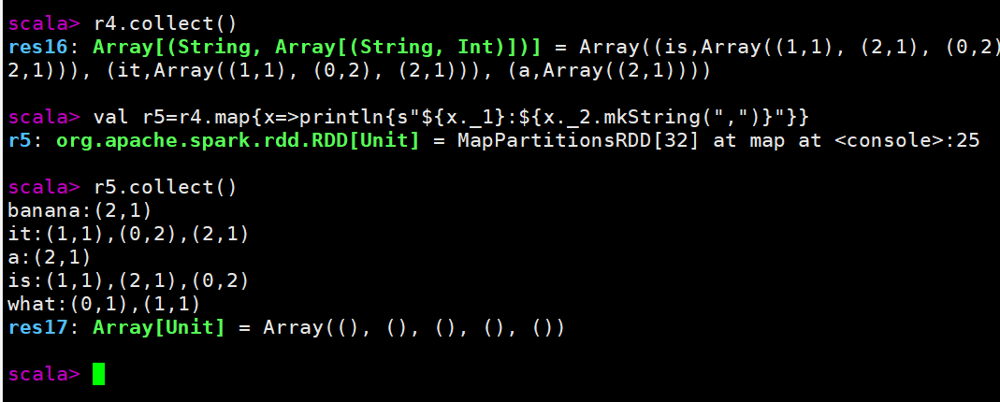

## 第一道题的解法

### 命令行方式

步骤一：

获取输入数据

```
val input=sc.wholeTextFiles("/home/admin/files/*")
```

步骤二：

将输入转换为文件名，文件内容

```
val r1=input.map{x=>(x._1.split("/").last.dropRight(0),x._2)}
```

步骤三：

切分文件内容（只考虑了一行的情况），转换为（词，文件名），1

```
val r2=r1.flatMap{x=>x._2.split("\\s+").map{word=>((word,x._1),1)}}
```

步骤四：

按照词和文件名进行分组，value累加

```
val r3=r2.reduceByKey(_+_).map{x=>(x._1._1,(x._1._2,x._2))}
```

步骤五：

按照词进行分组

```
val r4=r3.groupByKey().map{x=>(x._1,x._2.toArray)}
```

步骤六：

格式化输出

```
val r5=r4.map{x=>println{s"${x._1}:${x._2.mkString(",")}"}}
```

步骤六：

执行，打印

```
r5.collect()
```

结果：

